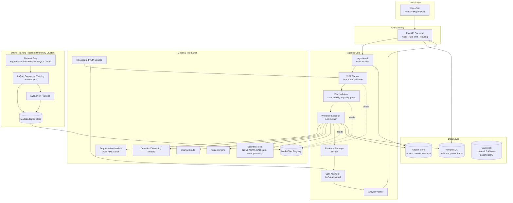
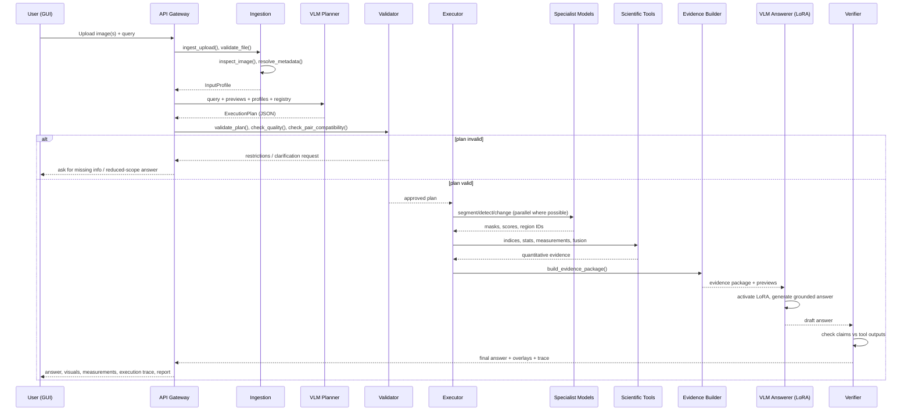
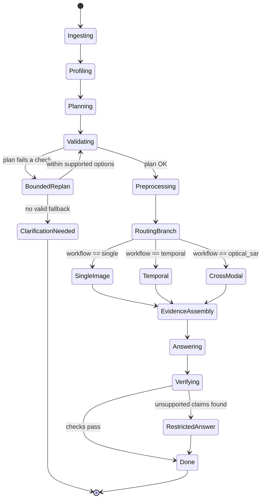
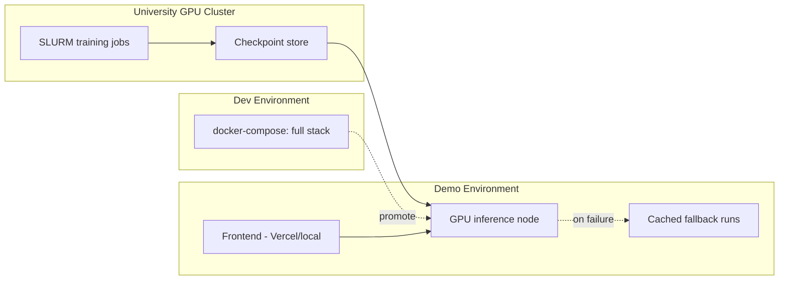
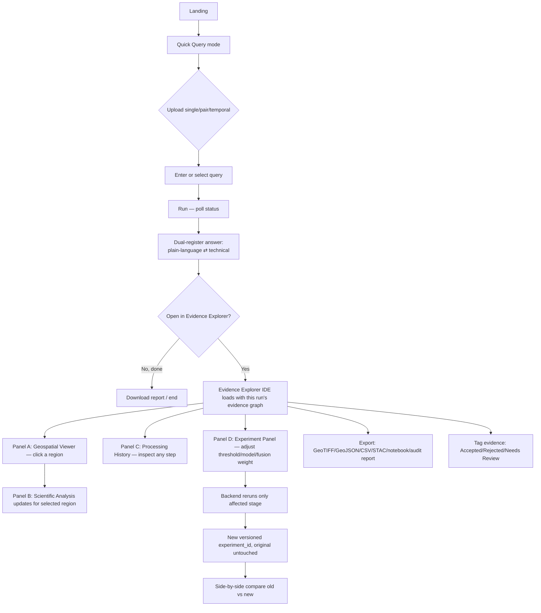

# SatQuery AI — System Architecture
### Agentic Vision-Language Assistant for Multimodal Remote Sensing Analysis
**PS ID:** 26167 · **Organisation:** ISRO/SAC · **Category:** Software · **Version:** 1.0
**Prepared for:** Kshitij Dahiya · SIH 2026

---

## 0. Document Purpose & Scope

This document is the single source of truth for building SatQuery AI end-to-end — not just the mandatory MVP scope, but the full production-grade system: training pipeline, inference backend, agentic controller, GUI, evaluation harness, and deployment.

It is written to be **buildable via AI-assisted ("vibe") coding**: every component has an explicit contract (inputs/outputs), so each module can be generated, tested, and swapped independently without an LLM assistant needing the whole system in context at once.

Non-negotiable design law, repeated everywhere in this doc:

> **The VLM plans and explains. The backend enforces scientific validity. Specialist models and tools produce evidence. The controller ties it all together and produces an auditable trace.**

A generic VLM directly answering questions from an image, with no adaptation and no enforcement layer, **does not satisfy the PS** — the whole point of this architecture is the enforcement + evidence layer around the VLM.

---

## 1. System Overview

### 1.1 What the system must do (from PS 26167)

| Mandatory capability | Input | Output |
|---|---|---|
| Single-image VQA | 1 optical/MS or SAR image + query | Grounded text answer |
| Single-image extra task | Same | Caption **or** region grounding |
| Bi-temporal change | 2 images (T1, T2), same area | Change description / change-VQA (+ optional change map) |
| Cross-modal (optical+SAR) | Co-registered optical/MS + SAR pair | Fused information extraction |
| Agentic orchestration | Any of the above | Task routing, model/tool selection, execution trace |

### 1.2 Core architectural principle: separation of concerns

```
Agent chooses     : task, models, tools, target classes/regions, final adapter
Backend enforces  : compatibility, prerequisites, preprocessing, scientific validity, execution limits
Models/tools      : produce spatial + quantitative evidence (masks, indices, stats)
VLM               : produces an understandable, evidence-grounded natural-language answer
Controller        : records everything as an auditable execution trace
```

This separation is what makes the system defensible in front of ISRO judges — every number in the final answer must be traceable to a tool call, not to VLM "confidence."

### 1.3 Two data representations kept strictly separate

| Representation | Purpose | Consumed by |
|---|---|---|
| **Scientific raster** | Original bands, calibrated values, valid-data mask | Scientific tools (NDVI, area, SAR stats) |
| **Visual preview** | Display-ready RGB/false-colour composite | VLM vision encoder, GUI |

A display stretch must never be substituted into a scientific calculation, and vice versa.

---

## 2. High-Level Architecture



---

## 3. Component Architecture

### 3.1 Frontend — Two Modes on One Design System

The frontend is **not one screen** — it's two purpose-built experiences sharing the same design tokens, component library, and backend contracts, so they never visually or behaviorally diverge:

| Mode | Who it's for | What it does |
|---|---|---|
| **Quick Query** | The PS's stated target user — a non-expert who just wants an answer | Upload → query → dual-register answer (plain-language + technical) in under a minute. This is the mandatory-scope demo path. |
| **Evidence Explorer** | GIS scientists, ISRO evaluators, anyone who wants to *interrogate* an answer rather than just receive it | A four-panel scientific workspace opened from any completed run via "Open in Evidence Explorer." Full detail in §3.11. |

**Stack:** Next.js (React) + TypeScript + Tailwind, MapLibre GL JS + TiTiler (COG tile serving — see §3.11), Zustand (lightweight client state — chosen over Redux specifically to keep the four-panel Explorer's frequent region/AOI selection changes cheap to re-render), TanStack Query (server-state caching so switching panels never re-fetches data that's already in memory).

**Full design system, color theme, and UX flow diagrams:** see §17. **Performance principles:** see §17.4.

Responsibilities of Quick Query mode specifically:
- Upload single image, cross-modal pair, or bi-temporal pair (GeoTIFF/TIFF; PNG/JPEG only for benchmark mode).
- Natural-language query box + query templates (from PS "representative queries").
- Render base image + mask/change overlays with confidence badges.
- Dual-register answer toggle (plain-language ⇄ technical/scientific phrasing — a prompt-layer variant in `answerer.py`, not a new subsystem; see `phases_dev.md` Chunk 9.2).
- Downloadable PDF/JSON report.
- Benchmark mode: browse VRSBench/RSVQA/CDVQA samples without upload.
- A persistent, unobtrusive "Open in Evidence Explorer" action on every completed run.

### 3.2 API Gateway / Backend

**Stack:** FastAPI (Python 3.11+), Pydantic v2 for schema validation, async endpoints, Celery + Redis for long-running jobs (training-adjacent or heavy inference), Uvicorn/Gunicorn behind Nginx.

Responsibilities: auth (simple JWT for demo), request validation, job orchestration handoff to the Agentic Core, serving results, serving artifacts from object store via signed URLs.

### 3.3 Agentic Controller (the heart of the system)

This is **not** a free-roaming LLM agent — it is a **constrained planner + deterministic executor**, matching the PS requirement that only the observable execution trace is evaluated, not private chain-of-thought.

```
Query + Images
      │
      ▼
┌─────────────────┐
│ 1. Ingest        │  ingest_upload(), validate_file()
└────────┬─────────┘
         ▼
┌─────────────────┐
│ 2. Input Profile │  inspect_image(), resolve_metadata()
└────────┬─────────┘
         ▼
┌─────────────────┐
│ 3. VLM Planner   │  fixed default config; outputs a structured JSON plan
└────────┬─────────┘
         ▼
┌─────────────────┐
│ 4. Plan Validator│  validate_plan(), check_quality(), check_pair_compatibility()
└────────┬─────────┘
     pass │ fail → bounded replan / clarify / restrict
         ▼
┌─────────────────┐
│ 5. Preprocessing │  prepare_model_input(image_id, model_id)
└────────┬─────────┘
         ▼
┌─────────────────┐
│ 6. Executor (DAG)│  runs single-image / temporal / optical-SAR branch (parallel where possible)
└────────┬─────────┘
         ▼
┌─────────────────┐
│ 7. Scientific    │  compute_spectral_index(), sar_statistics(), measure_regions(), spatial_relations()
│    Tools         │
└────────┬─────────┘
         ▼
┌─────────────────┐
│ 8. Evidence      │  build_evidence_package()
│    Package       │
└────────┬─────────┘
         ▼
┌─────────────────┐
│ 9. LoRA Activate │  activate adapter chosen in step 3
│    + VLM Answer  │
└────────┬─────────┘
         ▼
┌─────────────────┐
│ 10. Verify       │  verify_answer(): claims vs tool outputs, units, region IDs
└────────┬─────────┘
         ▼
   Final response + trace
```

**Why the plan is JSON, not free text:** the planner call returns a strict schema (see §4.2). This makes step 4 (validation) a simple rule engine instead of NLP parsing, and makes the execution trace machine-readable for the report/GUI.

### 3.4 Model Registry

A single source of truth (Postgres table + YAML/JSON manifest checked into the repo) listing every deployable model/tool and its **contract**. Nothing runs unless it's registered.

```yaml
# registry/models/seg_rgb_v1.yaml
id: SEG_RGB_v1
type: segmentation
modality: optical_rgb
input_contract:
  bands: [R, G, B]
  dtype: uint8
  scale: [0, 255]
  normalization: imagenet_mean_std
classes: [water, vegetation, built_up, bare_soil, cropland]
resolution_range_m: [0.3, 30]
endpoint: http://model-svc:8001/seg_rgb_v1
adapter_compatible: false
calibrated_confidence: true
version: 1.0.0
```

```yaml
# registry/models/seg_sar_vv_vh_v1.yaml
id: SEG_SAR_VV_VH_v1
type: segmentation
modality: sar
input_contract:
  polarization_order: [VV, VH]
  representation: dB          # or linear — must match training
  calibration_required: true
classes: [water, built_up]
endpoint: http://model-svc:8002/seg_sar_vv_vh_v1
version: 1.0.0
```

```yaml
# registry/adapters/lora_temporal_v1.yaml
id: LORA_TEMPORAL_v1
type: lora_adapter
base_model: rs_vlm_base_v1
task: change_understanding
trained_on: [CDVQA]
activation_point: language_component   # or vision_encoder
version: 1.0.0
```

Registry API (internal): `GET /registry/models?modality=sar`, `GET /registry/adapters?task=temporal`.

### 3.5 Remote-Sensing-Adapted VLM

- **Base model:** Qwen2.5-VL (7B, or smaller quantized variant for demo latency) — open, function-calling capable, image+text.
- **Adaptation:** PEFT/LoRA fine-tuning on BigEarthNet.txt (image–text pairs, Sentinel-1/2). This satisfies the PS's mandatory "remote-sensing adaptation" requirement.
- **Two roles, same base model, separate calls:**
  1. **Planner call** — fixed default adapter, structured JSON output (function-calling style).
  2. **Answerer call** — task-specific LoRA activated (single-image / temporal / cross-modal), free-text grounded answer.
- **Task adapters** (train only if time/compute allows, else share one general adapter):
  - `LORA_GENERAL` — VQA/caption/grounding (BigEarthNet.txt + VRSBench + RSVQA)
  - `LORA_TEMPORAL` — change VQA/description (CDVQA)
  - `LORA_CROSSMODAL` — optical+SAR joint reasoning (BigEarthNet.txt paired samples)

### 3.6 Specialist Model Layer

| Model | Architecture (suggested) | Trained on | Notes |
|---|---|---|---|
| RGB/MS segmenter | SegFormer-B0/B2 or U-Net | BigEarthNet v2 reference maps | class-compatible with VLM classes |
| SAR segmenter | U-Net w/ VV/VH input head | Sentinel-1 labeled subset | dB representation fixed at train time |
| Grounding/detector | Grounding-DINO-tiny or YOLO-World finetune | VRSBench referring boxes | optional, only for object-level queries |
| Change model (upgrade) | ChangeFormer (Siamese) | CDVQA/SECOND masks | baseline = segment T1,T2 then diff — build this first |
| Fusion engine | Evidence-level (weighted probability fusion) | n/a (formula-based) | upgrade path: learned fusion later |

Each specialist is served as an **independent microservice** behind a uniform contract:
```
POST /infer
{ "image_id": "...", "model_id": "...", "params": {...} }
→ { "masks": [...], "scores": [...], "region_ids": [...], "model_version": "..." }
```
This lets you deploy each on the university cluster independently and swap implementations without touching the controller.

### 3.7 Scientific Tools Layer

Pure-function, deterministic, no ML — these are what make the numbers trustworthy.

```
/backend/scientific_tools
  raster_io.py          # rasterio/GDAL wrappers: read bands, CRS, transform, NoData
  indices.py            # NDVI, NDWI, MNDWI, NDBI — band-contract enforced
  sar_stats.py          # backscatter mean/median, VV/VH ratio (linear only), temporal diff
  geometry.py           # measure_regions() — pixel→area, geodesic correction
  alignment.py          # check_pair_compatibility(), co-registration diagnostics
  quality.py            # cloud/shadow/NoData masks, valid-pixel computation
  compare.py            # compare_dates(): gain/loss/net transitions
  fuse.py               # fuse_evidence(): reliability-weighted probability fusion
```

Each function **raises a typed exception** (`MissingBandError`, `IncompatiblePairError`, `UnverifiedGeometryError`) rather than silently guessing — the executor catches these and either disables that specific output (e.g., "no hectares, here's pixel count") or triggers bounded replanning.

### 3.8 Artifact Store & Metadata DB

**Object store (MinIO, S3-compatible):**
```
/artifacts/{image_id}/original.tif
/artifacts/{image_id}/preview.png
/artifacts/{run_id}/masks/{region_id}.tif
/artifacts/{run_id}/overlays/{region_id}.png
/artifacts/{run_id}/evidence_package.json
/artifacts/{run_id}/report.pdf
```

**PostgreSQL schema (core tables):**
```sql
images(id, filename, format, sensor_type, bands_json, crs, transform_json,
       acquisition_date, sar_polarization, nodata_value, uploaded_at)

input_profiles(image_id, verified_fields_json, missing_fields_json,
                capability_restrictions_json)

execution_plans(id, query_text, workflow_type, selected_models_json,
                 selected_tools_json, target_classes_json, adapter_id,
                 fallback_policy_json, created_at)

execution_traces(id, plan_id, step_name, tool_or_model_id, params_json,
                  output_ref, status, duration_ms, timestamp)

evidence_packages(id, plan_id, measurements_json, masks_ref, overlays_ref,
                   confidence_json, limitations_json)

answers(id, plan_id, text, verified_bool, verification_report_json,
        created_at)
```

### 3.9 Training Pipeline (Offline, University Cluster)

Kept **entirely separate** from the inference system — no training happens at inference time.

```
/training
  /data_prep
    bigearthnet_loader.py     # handles all_data vs split field trap
    vrsbench_loader.py
    rsvqa_loader.py           # confirm variant: LR/HR/BEN-derived
    cdvqa_loader.py           # SECOND-derived masks kept separate from CDVQA QA
    splits.py                 # scene/geography-level split, leakage checks
  /lora
    train_lora_general.py     # PEFT/LoRA on base VLM
    train_lora_temporal.py
    train_lora_crossmodal.py
    configs/*.yaml
  /segmentation
    train_seg_rgb.py
    train_seg_sar.py
  /change
    train_changeformer.py     # optional upgrade
  /slurm
    submit_lora.sbatch
    submit_seg.sbatch
  /eval
    eval_vqa.py                # accuracy/F1 vs RSVQA/VRSBench refs
    eval_grounding.py          # IoU
    eval_change.py             # change-F1
    eval_calibration.py        # confidence calibration curves
```

**SLURM job skeleton** (`submit_lora.sbatch`):
```bash
#!/bin/bash
#SBATCH --job-name=satquery_lora
#SBATCH --gres=gpu:1
#SBATCH --time=12:00:00
#SBATCH --mem=64G
module load cuda/12.1
source ~/venvs/satquery/bin/activate
python training/lora/train_lora_general.py --config configs/lora_general.yaml
```

**Training order (avoids confusion, from your own field guide):**
1. Lock data contract + evaluation split (scene/geography-level, no leakage).
2. Baseline scores with off-the-shelf VLM + pretrained specialists.
3. Adapt shared VLM on BigEarthNet.txt (LoRA first, unfreeze more only if justified).
4. Train segmenters in parallel (independent of VLM branch).
5. Train task adapters (general/temporal/cross-modal) from the saved shared base.
6. Train/calibrate evidence integration (fusion reliability weights) on validation data.
7. Integrate controller + registry, then deploy.

### 3.10 Evaluation Harness

Runs automatically against held-out splits and produces a report card before every demo/submission:

| Axis | Metric | Source |
|---|---|---|
| VQA accuracy | Exact-match / accuracy | RSVQA, VRSBench |
| Captioning | BLEU/CIDEr (or LLM-judge score) | VRSBench |
| Grounding | IoU@0.5 | VRSBench boxes |
| Change VQA | Accuracy | CDVQA |
| Segmentation | mIoU | BigEarthNet v2 maps |
| Fusion benefit | Δaccuracy fused vs optical-only vs SAR-only | held-out cross-modal set |
| Calibration | ECE (expected calibration error) | all tasks |
| System | Latency, GPU mem, invalid-file handling rate | synthetic stress tests |

### 3.11 Evidence Explorer — The Scientific Workspace (Differentiator Feature)

**Why this exists:** the PS's own background section names the problem as *non-experts struggling to get meaning from imagery* — Quick Query solves that. But the PS is judged by ISRO scientists who will want to interrogate an answer, not just receive one. The Evidence Explorer is the system's answer to *"how do we know this isn't hallucinated, and can I second-guess it myself?"* — it turns the evidence graph your controller already builds (§3.3) into something a human can click through, challenge, and re-run.

**Core principle:** every conclusion stays inextricably linked to the pixels, steps, measurements, and uncertainty that produced it:

```
Final Claim ("Water increased by 14.7 ha")
   └─ Measurement (geometric projection over valid area)
        └─ Region ID / Polygon (R-017, stored in PostGIS)
             └─ Mask / Index Raster (new-water mask, MNDWI + SAR backscatter confirmed)
                  └─ Model / Physics Tool (Multispectral SegFormer v2.1)
                       └─ Inputs & Metadata (T1/T2 GeoTIFFs, alignment error, confidence)
```

This is a strict superset of `EvidencePackage` (§4.3) — the flat `claims` list Quick Query uses is one traversal of this same graph, not a separate data structure. See §15 for the schema and PostGIS/STAC backing.

**Four panels, one workspace:**

**A. Geospatial Viewer** — MapLibre GL JS + TiTiler serving Cloud-Optimized GeoTIFFs as map tiles (never loading a full-resolution raster into browser memory — this is the single biggest lever for keeping the Explorer fast, see §17.4). Supports: overlay opacity control, T1/T2 swipe comparison, optical/SAR side-by-side, AOI drawing, click-a-region-to-inspect wired straight into the evidence graph.

**B. Scientific Analysis Panel** — region-scoped metrics: area/coverage, NDVI/MNDWI/NDBI stats, VV/VH backscatter distribution, gain/loss/class-transition matrices, cloud coverage %, fusion weights, per-class confidence — all sourced from the same `scientific_tools/` functions the executor already calls, never recomputed differently for display purposes.

**C. Processing History** — the machine-readable execution trace (§12) rendered as a literal timeline: input validation → cloud masking → alignment → segmentation → index calculation → area measurement → fusion → VLM explanation, each step showing exact parameters, model/adapter version, timestamp, and generated artifact link.

**D. Research Experiment Panel ("What-If" Engine)** — the actual novel capability. A scientist can change a segmentation threshold, swap in an alternate registered model (populated live from `registry.query()` — the same models the agent could have chosen), toggle a physics-tool confirmation on/off, adjust fusion weights, or manually correct a mask. **The system reruns only the affected downstream stage** (it knows the DAG boundaries already, from §3.3/§6) and saves the result as a new versioned `experiment_id` linked to the parent `run_id` — the original is never overwritten. This is what makes the tool trustworthy to a scientist: they can challenge the AI's choices and see, immediately, whether the conclusion holds up.

**Reproducibility guarantees** (what makes this "enterprise-grade," not a toy viewer):
- Every run/experiment gets a permanent `run_id`/`experiment_id`.
- STAC (SpatioTemporal Asset Catalog) entries for every image, mask, and derived artifact — see §16.
- A full state-recording manifest per run: input checksums, sensor bands, CRS, pixel resolution, model/LoRA versions, software versions, tool formulas, user corrections.
- Export: GeoTIFF masks/indices, GeoJSON/Shapefile region boundaries, CSV measurements, STAC metadata, full audit report, and a **reproducible Jupyter notebook** (`nbformat`-generated) that reconstructs the exact pipeline run locally.
- A lightweight feedback loop: any evidence node can be tagged Accepted/Rejected/Needs Review by a reviewer, stored for later active-learning retraining (a real bridge back into `phases_ml.md`'s training pipeline, not just a UI gesture).

**What this deliberately is not:** a second product. Quick Query and Evidence Explorer read the same backend, the same registry, the same evidence graph, and the same design tokens (§17). A scientist opening a run in the Explorer sees a deeper view of literally the same answer a non-expert already got in Quick Query — never a different pipeline pretending to be the same system.

---

## 4. Data Model / Core Schemas

### 4.1 InputProfile (output of step 2)

```json
{
  "image_id": "img_0091",
  "format": "GeoTIFF",
  "dimensions": [1024, 1024],
  "channels": 4,
  "band_identities": ["R", "G", "B", "NIR"],
  "sensor_type": "optical_multispectral",
  "crs": "EPSG:32643",
  "pixel_spacing_m": [10.0, 10.0],
  "acquisition_date": "2025-11-02",
  "sar_polarization": null,
  "nodata_value": 0,
  "valid_pixel_fraction": 0.94,
  "verified_fields": ["dimensions", "crs", "pixel_spacing"],
  "missing_fields": ["cloud_mask"],
  "capability_restrictions": ["area_estimation: uncertain without cloud mask"]
}
```

### 4.2 Execution Plan (output of step 3, the VLM planner)

```json
{
  "workflow": "temporal",
  "images": ["img_0091", "img_0092"],
  "target_classes": ["water", "cropland"],
  "required_models": ["SEG_RGBNIR_v1"],
  "optional_tools": ["compute_spectral_index:NDWI"],
  "requested_outputs": ["change_map", "area_estimate"],
  "final_adapter": "LORA_TEMPORAL_v1",
  "fallback": "spatial_description_without_hectares_if_scale_unavailable"
}
```

### 4.3 Evidence Package (output of step 8)

```json
{
  "run_id": "run_2026_00417",
  "claims": [
    {
      "claim": "water area increased",
      "measurement": "gain_area_ha=14.2",
      "region_id": "reg_003",
      "source_images": ["img_0091", "img_0092"],
      "tool": "measure_regions",
      "confidence": 0.81
    }
  ],
  "masks_ref": "s3://artifacts/run_2026_00417/masks/",
  "overlays_ref": "s3://artifacts/run_2026_00417/overlays/",
  "limitations": ["cloud cover 6% at T2, excluded from valid area"],
  "model_versions": {"SEG_RGBNIR_v1": "1.0.0", "LORA_TEMPORAL_v1": "1.0.0"}
}
```

---

## 5. Inference Lifecycle — Full Sequence Diagram



---

## 6. Agentic Controller — Decision Logic (State Machine)



Key rule encoded here: **a failed prerequisite disables one output (e.g., hectares), not the entire answer.** This graceful-degradation behavior should be tested explicitly — it's a strong talking point for judges ("what happens when scale is unavailable?").

---

## 7. API Contracts (external, GUI-facing)

```
POST   /api/v1/images                     multipart upload → {image_id, input_profile}
POST   /api/v1/pairs                      register cross-modal or bi-temporal pair → {pair_id}
POST   /api/v1/query                      {image_id(s), query_text} → {run_id} (async)
GET    /api/v1/runs/{run_id}              → status | full result
GET    /api/v1/runs/{run_id}/trace        → execution trace (machine-readable)
GET    /api/v1/runs/{run_id}/report       → downloadable PDF
GET    /api/v1/registry/models            → list of registered models/tools
GET    /api/v1/benchmark/samples          → curated VRSBench/RSVQA/CDVQA demo samples
```

Internal (controller ↔ model services):
```
POST /internal/plan            (VLM planner call)
POST /internal/segment
POST /internal/detect
POST /internal/change
POST /internal/fuse
POST /internal/tool/{tool_name}
POST /internal/answer          (VLM answerer call, LoRA-specified)
```

---

## 8. Technology Stack Summary

| Layer | Technology |
|---|---|
| Frontend (shared) | Next.js, TypeScript, Tailwind, Zustand (client state), TanStack Query (server-state caching) |
| Geospatial Viewer | MapLibre GL JS, TiTiler (COG tile serving), maplibre-gl-draw (AOI drawing) |
| Frontend performance | react-window (list virtualization), route-based code splitting, COG tiling instead of full-raster loads |
| API Gateway | FastAPI, Pydantic v2, Uvicorn, Nginx |
| Async jobs | Celery + Redis |
| Agentic Controller | Custom Python state machine (NOT a black-box agent framework) |
| VLM base | Qwen2.5-VL (7B or quantized) — see `CLAUDE.md` for the Qwen3.5-VL evaluation note |
| Fine-tuning | HuggingFace PEFT (LoRA), bitsandbytes for 4/8-bit |
| Segmentation | segmentation-models-pytorch / SegFormer (HuggingFace) |
| Detection/Grounding | Grounding-DINO-tiny / YOLO-World (optional) |
| Change detection | ChangeFormer (optional upgrade) or baseline diff-of-segmentations |
| Raster I/O | rasterio, GDAL, numpy |
| Model serving | Ray Serve (or plain FastAPI microservices for simplicity) |
| Metadata DB | PostgreSQL + PostGIS extension + SQLAlchemy/SQLModel |
| Cataloging | STAC (SpatioTemporal Asset Catalog) via `pystac` |
| Reproducible exports | `nbformat` (notebook generation), `fiona`/`shapely` (Shapefile/GeoJSON export) |
| Object store | MinIO (S3-compatible) |
| Training infra | University SLURM cluster, PyTorch, Weights & Biases (experiment tracking) |
| Containerization | Docker + docker-compose (dev), optional Kubernetes for demo scaling |
| CI | GitHub Actions (lint, unit tests, eval harness on PR) |

---

## 9. Repository Structure

Covered by the project starter scaffold, not duplicated here. New files introduced by any phase in `phases_dev.md`/`phases_ml.md` should mirror the convention of sibling files already present in the same directory of the starter.

---

## 10. Deployment Architecture

**Development:** `docker-compose up` — Postgres, MinIO, Redis, backend, all model services on localhost/university workstation with GPU passthrough.

**Training:** SLURM jobs on university cluster → checkpoints synced to MinIO/model store → registry manifest updated with new version + eval scores.

**Demo Day:** Single beefy GPU node (cluster or cloud burst instance) running docker-compose stack; frontend deployed to Vercel or served locally; fallback pre-computed demo runs cached in case of live-network issues (judges will test edge cases — always have a recorded fallback for the exact representative queries in the PS).



---

## 11. Security, Validation & Guardrails

- **Server-side credentials only** — model endpoints, DB, object store credentials never touch the frontend or the VLM prompt.
- **File validation before any processing** — reject malformed rasters, oversized files, unsupported formats early (`validate_file()`).
- **No band/sensor guessing** — a missing field stays `null`/`unknown`; the system must say "cannot verify" rather than assume.
- **Bounded replanning** — the agent gets a limited number of retries (e.g., 1 bounded replan) before falling back to a restricted answer; no infinite retry loops.
- **Input sanitization on query text** — treat user query as data for the planner prompt, not as executable instruction to the backend (avoid prompt-injection-driven tool misuse — the validator is the real gatekeeper, not the VLM's judgment).
- **Audit log immutability** — execution traces are append-only records in Postgres, timestamped, tied to run_id.

---

## 12. Observability & Audit Trail

Every run produces a **machine-readable execution trace** (not chain-of-thought) containing:
```
run_id, input image IDs, classified task, selected workflow,
each model/tool called (name + version + params), each tool's output reference,
final adapter used, verification result, total latency, any restrictions applied
```

This trace is:
1. Shown in the GUI's "Trace" panel (judges can inspect it live).
2. Exported in the downloadable report.
3. Logged centrally for the evaluation harness to cross-check reproducibility.

Recommended tools: structured JSON logging (`structlog`), optional Grafana + Prometheus for latency/throughput dashboards during the demo.

---

## 13. Scalability & Extension Points

Designed so each piece can grow after SIH without a rewrite:

| Extension | How the architecture supports it |
|---|---|
| More sensors (Cartosat, RISAT specifics) | Add new registry entries with their own input contracts; no controller code changes |
| More dates (multi-temporal series) | `compare_dates()` generalizes to `compare_sequence()`; executor DAG already supports N-way branches |
| Learned fusion instead of evidence-level | Swap `fuse_evidence()` implementation behind the same interface |
| New task adapters | Add to registry; planner's model-selection prompt is data-driven off the registry, not hardcoded |
| Real-time/streaming imagery | Ingestion layer already treats each image as an independent unit with an ID — a streaming queue can feed the same `ingest_upload()` path |

---

## 14. Risk Register & Mitigations

| Risk | Likelihood | Impact | Mitigation |
|---|---|---|---|
| Domain shift: Sentinel-trained models vs. hidden Cartosat-2S/RISAT set | High | High | Validate on any available Cartosat/RISAT-like samples early; report transfer-gap honestly in eval harness; don't over-promise |
| Compute/time insufficient to train every specialist | Medium | High | Priority order in §3.9; baseline-first, upgrade-if-time policy; share one general LoRA before splitting adapters |
| "Agentic" claim not actually demonstrated live | Medium | High | Build the plan JSON + trace panel early — it's cheap and is the most convincing thing to show judges |
| SAR preprocessing errors (dB vs linear, polarization order) | Medium | Medium | Enforce via registry input_contract; unit tests per model service |
| Judging metric weights unknown (placeholder in PS) | Certain | Medium | Build a broad evaluation harness (§3.10) covering all axes instead of optimizing one guessed metric |
| Live demo network/GPU failure | Low | High | Pre-recorded fallback run + cached results for the PS's representative queries |
| Evidence Explorer scope threatens core mandatory scope under time pressure | Medium | High | Build strictly after Quick Query mode is fully working end-to-end (Phase 12); Explorer is additive depth, never a dependency of the mandatory PS scope — if time runs out, ship Quick Query alone and it still satisfies every mandatory requirement |

---

## 15. Evidence Graph Schema (PostGIS-backed)

Extends `EvidencePackage` (§4.3) from a flat claims list into the full traceable graph described in §3.11. New DB tables (PostgreSQL + PostGIS extension):

```
regions(id, run_id, geometry [PostGIS geometry column], class_label, source_mask_ref)
evidence_nodes(id, run_id, node_type [claim|measurement|region|mask|model|input],
                content_json, parent_node_id, created_at)
experiments(id, parent_run_id, parameter_overrides_json, rerun_stage_from,
             created_at, status)
feedback_tags(id, evidence_node_id, tag [accepted|rejected|needs_review],
               reviewer_note, created_at)
```

`evidence_nodes.parent_node_id` forms the graph edges described in §3.11's traversal (`Final Claim → Measurement → Region → Mask → Model → Inputs`). `regions.geometry` is a real PostGIS geometry column so AOI queries ("which claims touch this polygon") are database-native spatial queries, not application-level raster math. `experiments` is what makes the What-If Engine's "rerun only the affected stage, never overwrite the original" guarantee a DB-level fact rather than a UI convention.

## 16. STAC Catalog & Reproducibility Manifest

Every ingested image, generated mask, and evidence package is registered as a STAC Item (`pystac`) linking back to its `run_id`/`experiment_id` — this is what makes "enterprise-grade reproducibility" a real, queryable property instead of a claim in a slide. Alongside the STAC catalog, every run writes a `run_manifest.json`:

```json
{
  "run_id": "run_2026_00417",
  "input_checksums": {"img_0091": "sha256:...", "img_0092": "sha256:..."},
  "sensor_bands": {"img_0091": ["R","G","B","NIR"]},
  "crs": "EPSG:32643", "pixel_resolution_m": [10.0, 10.0],
  "model_versions": {"SEG_RGBNIR_v1": "1.0.0", "LORA_TEMPORAL_v1": "1.0.0"},
  "software_versions": {"rasterio": "1.3.9", "torch": "2.3.0"},
  "tool_formulas_used": ["NDWI", "measure_regions:geodesic"],
  "user_corrections": []
}
```
This manifest is what the reproducible-notebook export (§3.11) is generated from — the notebook is a faithful re-serialization of this manifest into runnable code, not a separately-maintained artifact that can drift from what actually ran.

## 17. Frontend Design System & UX Flow

### 17.1 Why this section exists

A hackathon-built frontend defaults to looking like a hackathon-built frontend: generic purple-to-blue gradients, glowing blob shapes, Poppins/Montserrat rounded-everything, chatbot-bubble UI metaphors, bouncy micro-animations. That aesthetic actively undermines this specific product — a scientific instrument being pitched to ISRO evaluators should look like professional tooling (Mapbox Studio, Linear, a mission-control dashboard), not a consumer AI-wrapper demo. This section is a hard constraint, not a suggestion: **anyone building a UI component checks this section first.**

### 17.2 Color theme — "Mission Control"

Dark-first (satellite imagery and mask overlays read far better against a dark canvas than a white one — this is also why every professional GIS tool defaults dark), high-contrast data readouts, one restrained accent color instead of a decorative gradient.

| Token | Value | Use |
|---|---|---|
| `--bg-primary` | `#0B0E14` | App background |
| `--bg-panel` | `#12161F` | Panel/card surfaces |
| `--bg-panel-raised` | `#181D29` | Modals, dropdowns |
| `--border-subtle` | `#232937` | 1px borders — flat surfaces, not heavy shadows |
| `--text-primary` | `#E6E9EF` | Primary text |
| `--text-secondary` | `#8A93A6` | Secondary/muted text |
| `--accent` | `#3DDBD9` | Single accent — teal, reads as "geospatial/scientific," not generic-AI-purple |
| `--success` | `#3FB950` | Confirmations, passed checks |
| `--warning` | `#D29922` | Restrictions, domain-shift flags |
| `--danger` | `#F85149` | Hard errors, failed verification |

**Mask/overlay palette** (fixed per class, colorblind-considered, used identically in Quick Query and Explorer so a color always means the same thing):

| Class | Color |
|---|---|
| Water | `#4C8DFF` |
| Vegetation | `#3FB950` |
| Built-up | `#F0883E` |
| Cropland | `#9ECE6A` |
| Bare soil | `#C9A876` |
| Unknown / unassessable | `#5B6272` (desaturated gray — deliberately unappealing, so "we don't know" never looks like a confident result) |

**Explicit anti-patterns — do not do these:**
- No gradient backgrounds as a primary design element.
- No glowing/blurred orb or blob shapes (the current "generic AI product" visual cliché).
- No fully-rounded pill buttons everywhere — use a moderate, consistent radius (6–8px).
- No bouncy/playful easing on transitions — 150–200ms `ease-out` only, on state changes, never decorative.
- No chat-bubble metaphors for the answer display — this is an instrument reading out a result, not a conversation.

### 17.3 Typography

- **UI text:** Inter (or IBM Plex Sans) — neutral, professional, what serious developer/data tools use, not what marketing-site AI startups use.
- **Data/numeric readouts:** JetBrains Mono (or IBM Plex Mono) for every measurement, coordinate, run ID, confidence score, and code-like value. This single choice does more than anything else to make the product read as "real engineering tool" rather than "generated app" — compare any Linear/Vercel/GitHub dashboard to a generic AI demo and the monospace-for-data convention is the tell.
- Scale: 12/14/16/20/24/32px, one consistent step ratio, defined once as Tailwind theme tokens, never ad-hoc per component.

### 17.4 Performance principles ("not laggy" is an architecture decision, not a hope)

| Principle | Concrete implementation |
|---|---|
| Never load a full-resolution raster into the browser | MapLibre + TiTiler tile serving from COGs (§3.11) — the browser only ever holds visible tiles |
| Panel switches feel instant | TanStack Query caches evidence-graph/run data per `run_id`; switching panels reads cache, never re-fetches |
| Large lists don't jank | `react-window` virtualization for Processing History steps and any region list |
| Heavy panels don't block first paint | Route/component-level code splitting — the Experiment Panel's bundle loads only when opened, not on initial page load |
| State updates don't cascade re-renders | Zustand with selector-based subscriptions (not one giant global store object) for AOI selection, active experiment diff, and panel layout state |
| Interaction latency budget | Target <100ms for any panel-switch or region-click response; anything touching the backend (rerun, export) shows an explicit progress state within 200ms, never a silent hang |

### 17.5 UX Flow



Quick Query is the default landing experience and the mandatory-scope demo path — it must work standalone with zero dependency on the Explorer. The Explorer is additive depth, not a gate the user must pass through to get an answer.

## 18. Build Roadmap (Architecture-Mapped Phases)

| Phase | Deliverable | Architecture components touched |
|---|---|---|
| 1 | Data contracts + registry skeleton + Postgres schema | §3.4, §4 |
| 2 | Ingestion + InputProfile + scientific tools (raster_io, indices) | §3.3 steps 1-2, §3.7 |
| 3 | Baseline segmenters (RGB, SAR) trained on cluster | §3.6, §3.9 |
| 4 | Shared VLM LoRA adaptation on BigEarthNet.txt | §3.5, §3.9 |
| 5 | Planner + Validator (plan JSON schema, rule-based checks) | §3.3 steps 3-4 |
| 6 | Executor DAG for single-image workflow end-to-end | §3.3 steps 5-7, §5 |
| 7 | Temporal workflow (baseline diff-of-segmentations) | §3.6 change model, §5 |
| 8 | Cross-modal fusion (evidence-level formula) | §3.7 fuse.py |
| 9 | Evidence package + VLM answerer + verifier | §3.3 steps 8-10 |
| 10 | GUI: upload, query, map viewer, trace panel, report export | §3.1 |
| 11 | Evaluation harness run across all 4 datasets | §3.10 |
| 12 | Hardening: fallback paths, demo rehearsal, cached backups | §12, §14 |
| 13 | Frontend design system foundation (tokens, primitives) | §17 |
| 14 | Two-mode frontend flow + state layer | §17.5, §3.1 |
| 15 | Evidence graph, PostGIS, STAC/reproducibility backend | §15, §16 |
| 16 | Geospatial Viewer + Scientific Analysis + Processing History panels | §3.11 A–C |
| 17 | Research Experiment "What-If" Engine | §3.11 D |
| 18 | Export, reproducible notebooks, feedback loop | §3.11 |

---

## 19. Final Mental Model (one paragraph)

Pixels provide observations. Metadata gives context and geometry. The registry says what's allowed. The planner (VLM, constrained) decides what analysis the query needs. The validator refuses anything unsupported by the actual data. Specialists localize; scientific tools measure; the fusion engine combines evidence honestly, disclosing disagreement instead of hiding it. The answering VLM explains the evidence in plain language without inventing numbers. The verifier double-checks every claim against the tools before anything reaches the user. The controller records all of this as a trace — that trace, not the model count, is what proves this is a real agentic system to ISRO's judges.
