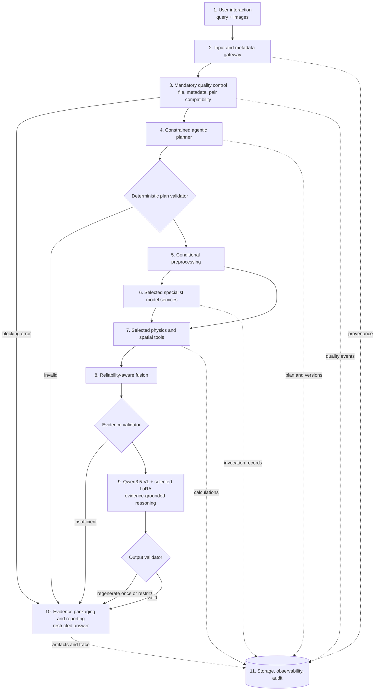

# System Architecture

## Status and invariant

This is a proposed architecture; none of its services is implemented. Its invariant is: **the VLM selects the analysis; the backend enforces scientific validity**. The corresponding decision is recorded in [ADR-001](decisions/ADR-001-hybrid-neuro-symbolic-architecture.md).

## Layers

1. **User interaction:** a future Next.js/MapLibre interface accepts images, a query, and optional user-supplied metadata. Non-georeferenced images use an image viewer, not a misleading map projection.
2. **Input and metadata gateway:** identifies file type, computes identity/checksum, parses explicit metadata, and represents unavailable values. It never derives sensor identity from channel count.
3. **Mandatory quality-control layer:** validates integrity, invalid pixels, bands/polarisations, scale, clouds or SAR quality, and pair compatibility. Blocking results restrict downstream work.
4. **Agentic workflow planner:** a constrained LangGraph flow turns the query and validated inventory into a typed proposal for workflow, models, tools, outputs, and limitations.
5. **Preprocessing services:** separate optical, multispectral, SAR, and pair pipelines preserve source values and coordinate mappings while producing compatible model tensors.
6. **Specialist services:** independently served optical SegFormer, four-band multispectral SegFormer, SAR U-Net, and optional ChangeFormer capabilities. A registry resolves capability names to versioned deployments.
7. **Physics and spatial tools:** deterministic indices, backscatter statistics, area, coverage, polygon, topology, and transition functions expose declared preconditions and provenance.
8. **Reliability-aware fusion:** rule-based weights first combine only compatible evidence, flag contradictions, fall back to a usable modality, or abstain.
9. **Qwen3.5-VL and Multi-LoRA reasoning:** a verified compatible checkpoint interprets structured evidence. A capability-oriented adapter may help grounding, temporal reasoning, optical–SAR reasoning, or reporting.
10. **Evidence packaging and reporting:** produces masks, regions, measurements, natural-language output, confidence, limitations, and trace; final validation prevents unsupported units or metadata claims.
11. **Storage, observability, and audit:** PostgreSQL/PostGIS stores records/geometries, object storage keeps rasters, and structured telemetry records versions and decisions without unnecessary sensitive content.

## Execution classes

| Class | Components | Selection rule |
|---|---|---|
| Always-run deterministic | ingestion, metadata extraction, file validation, relevant compatibility checks, plan/output schema validation, audit events | Cannot be skipped by agent |
| Conditional deterministic | band-safe preprocessing, indices, SAR statistics, area/topology, alignment, quality weights | Selected only when preconditions and query require them |
| Specialist model service | optical, multispectral, SAR segmenters; optional change model | Registry and validated input contract decide compatible service |
| Final VLM reasoning | contextual synthesis and grounded explanation with chosen adapter | Receives evidence after validation; never substitutes for measurement |
| Output validation | claim/region/unit/provenance/limitation checks | Runs on all returned answers, including restricted results |

## Deployment boundaries

The public boundary should be a small FastAPI analysis API. Model endpoints remain internal behind typed capability contracts, timeouts, retries, circuit breakers, and GPU safeguards. The MVP can colocate services on one GPU host via Docker Compose and Ray Serve; independent autoscaling and Kubernetes are later decisions. See [12-deployment-plan.md](12-deployment-plan.md).
