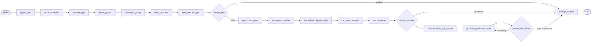

# Agent and Tool Design

## Constrained state machine

LangGraph is proposed for an explicit state machine; it is not implemented. The planner can propose capabilities, but deterministic nodes enforce prerequisites and state transitions.



`run_selected_models` and tool nodes may be no-ops for a supported qualitative query. The trace must say they were intentionally skipped. An area query requires a mask plus valid scale; a temporal query requires compatible observations; optical–SAR fusion requires coverage and quality assessment.

## Function classes

Always-run backend functions include metadata extraction, file validation, relevant pair/modality compatibility checks, workflow/output schema validation, and audit logging. Mandatory quality checks run whenever their input type makes them relevant.

Conditional internal tools include preprocessing, semantic segmentation, optional change detection, spectral indices, SAR statistics, mask area/coverage, topology, transitions, and reliability fusion. Each tool advertises `requires`, `produces`, units, failure modes, version, timeout, and whether its output can support a measurement.

MCP should be used only when a capability must be interoperable with external agents/services. Low-level internal functions remain normal typed Python services; creating an MCP server per formula would add operational surface without improving scientific validity.

## Example capability record

```json
{
  "capability": "segment_multispectral",
  "service": "multispectral_segmentation",
  "requires": [
    "verified_red",
    "verified_green",
    "verified_blue",
    "verified_nir"
  ],
  "produces": ["semantic_mask", "class_probabilities"],
  "deployment": "ray_serve",
  "status": "proposed"
}
```

## Example execution plan

```json
{
  "workflow": "single_image",
  "task": "area_measurement",
  "target_classes": ["water"],
  "inputs": ["IMG-001"],
  "preprocessing": ["optical_normalisation", "cloud_mask"],
  "models": ["optical_segmentation"],
  "physics_tools": [],
  "spatial_tools": ["georeferenced_area"],
  "provisional_lora": "grounding_vqa",
  "required_outputs": ["semantic_mask", "measurement", "evidence_regions"],
  "limitations": [],
  "validation": {
    "verified_rgb": true,
    "trusted_pixel_scale": true,
    "status": "eligible_for_backend_validation"
  }
}
```

This plan is a proposal, not authorization to execute. The validator still checks that `IMG-001` has verified bands, a trusted affine transform/CRS or accepted scale, sufficient valid coverage, and a compatible registered model version.

## State and audit requirements

State should carry immutable input references, metadata provenance, quality/compatibility reports, query intent, proposed and validated plans, invocation records, regions, measurements, fusion decisions, adapter/model versions, limitations, and validation outcomes. Any correction creates a new event rather than silently rewriting provenance. Prompt text must never contain hard-coded internal URLs or credentials.

See [API and data contracts](10-api-and-data-contracts.md) and [ADR-003](decisions/ADR-003-constrained-agent-orchestration.md).
